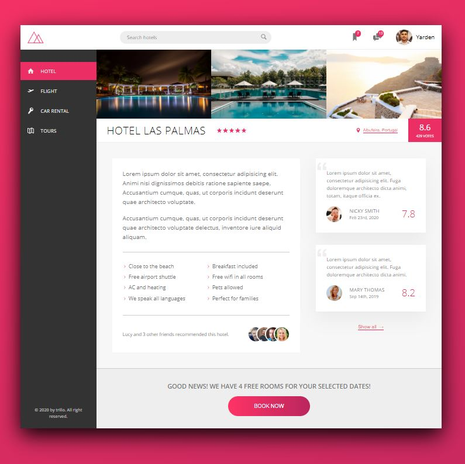

# Trillo: Sass & CSS Project

### Introduction

This project was made with the purpose to show some `Sass` and `CSS3` features and use as a ready template that could be adapted to any landing page.

## Live demo

[Click here](https://yardenporat.github.io/trillo/)

## Building this project for production

-   **Install Dependencies** - You need to run `npm install` to use the required libraries

-   **Run the build script** - In the `package.json` you'll se some scripts that compile the code, adding and compressing the sass files to better performance and optimization.
    ```sh
    npm run build
    ```
-   **Get the compiled result** - When the build is complete, it will generate a `style.css` in de `css/` folder, that you could use in your applications.

## Yarden Porat

-   Contact - yardenporat@gmail.com
-   Linkedin - https://www.linkedin.com/in/yardenporat/


